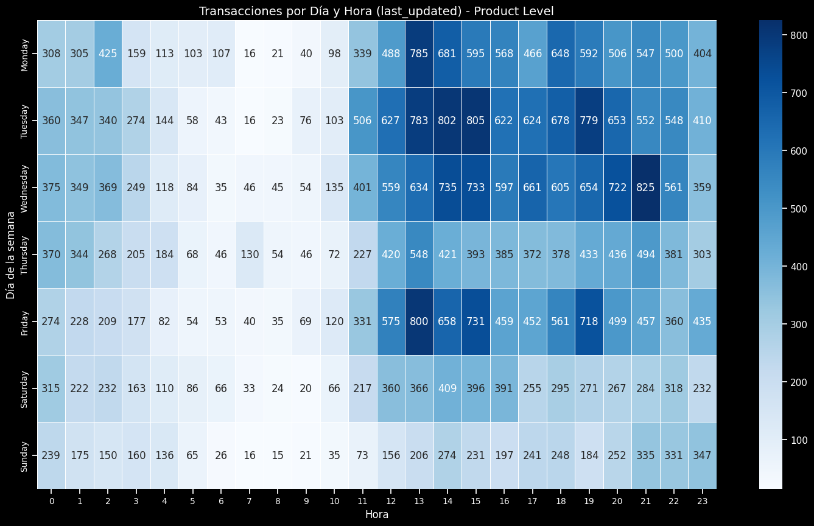

# Clasificación de Artículos Nuevos/Usados para MercadoLibre

## Tabla de Contenido
- [Descripción del Problema](#descripción-del-problema)
- [Estructura del Proyecto](#estructura-del-proyecto)
- [Distribución de Clases](#distribución-de-clases)
- [Análisis Exploratorio de Datos](#análisis-exploratorio-de-datos)
  - [Estructura del Dataset](#estructura-del-dataset)
  - [Variables Relevantes](#variables-relevantes)
  - [Análisis de Correlaciones](#análisis-de-correlaciones)
- [Insights](#insights)
- [Criterios de Selección de Variables](#criterios-de-selección-de-variables)
  - [Feature Selection](#feature-selection)
  - [Feature Engineering](#feature-engineering)
  - [Pipeline](#pipeline)
- [Modelado](#modelado)
  - [Estrategia de Modelado](#estrategia-de-modelado)
  - [Hiperparámetros Optimizados](#hiperparámetros-optimizados)
- [Resultados](#resultados)
  - [Métricas Alcanzadas](#métricas-alcanzadas)
  - [Curvas de Aprendizaje](#curvas-de-aprendizaje)
  - [Importancia de Variables](#importancia-de-variables)
- [Conclusiones](#conclusiones)

## Descripción del Problema
El proyecto consiste en desarrollar un modelo de clasificación binaria que determine si un artículo publicado en MercadoLibre es nuevo o usado, basado en características del producto y de su publicación. Se busca obtener un modelo robusto que permita distinguir correctamente entre ambos estados, mejorando la precisión en comparación con análisis previos realizados en notebooks.

## Estructura del Proyecto
```
├── artifacts
│   ├── models
│   └── pipelines
├── config
├── data
├── docs
├── mlruns
├── notebooks
│   ├── experiments
│   └── exploration
├── reports
├── src
│   ├── dataset
│   ├── features
│   ├── models
│   └── utils
├── LICENSE
├── README.md
├── main.py
├── poetry.lock
└── pyproject.toml
```

## Distribución de Clases

La gráfica muestra la proporción de artículos en dos categorías de condición ("new" y "used"). Se observa que la mayoría de los artículos se clasifica como nuevos (alrededor de un 55%), mientras que el resto corresponde a artículos usados (en torno al 45%).


## Análisis Exploratorio de Datos

### Estructura del Dataset
- Se utilizó un conjunto de datos que contiene diversas características de los productos, tales como información de precios, vendedores, envíos y atributos específicos.
- Se realizaron procesos de limpieza y transformación para manejar valores faltantes y codificar variables categóricas.

### Variables Relevantes
Se identificaron los siguientes grupos de variables:

1. **Variables de Precio y Cantidad**:
   - Precio unitario
   - Cantidad disponible
   - Cantidad vendida
   - Stock inicial

2. **Variables de Envío**:
   - Método de envío
   - Envío gratuito
   - Retiro local

3. **Variables de Ubicación**:
   - Estado/Provincia
   - Ciudad

4. **Variables de la Publicación**:
   - Tipo de listado
   - Modo de compra
   - Aceptación de MercadoPago
   - Atributos del producto

## Insights

En esta sección se presentan algunos hallazgos clave (insights) relevantes para la estrategia de modelado y la comprensión del negocio:

1. **Distribución geográfica por condición**  
     
   - La mayoría de las publicaciones (nuevas y usadas) provienen de la región de Buenos Aires y Capital Federal.  
   - Esto sugiere que la oferta principal de MercadoLibre se concentra en zonas urbanas de alta densidad poblacional.

2. **Moneda utilizada por condición**  
     
   - La divisa predominante es el peso argentino (ARS) tanto para productos nuevos como usados.  
   - El uso de USD es marginal, lo que indica que la mayor parte de las transacciones se realizan en moneda local.

3. **Transacciones por Día y Hora (fecha de creación)**  
     
   - Se observa un mayor volumen de publicaciones en días hábiles, con picos alrededor del mediodía y la tarde.  
   - Estos patrones pueden indicar los momentos de mayor actividad de los vendedores.

4. **Transacciones por Día y Hora (última actualización)**  
     
   - El comportamiento de actualizaciones sigue una tendencia similar a la de creación, reforzando la idea de mayor actividad en horarios de trabajo.  
   - Esto puede servir para optimizar estrategias de pricing o de relanzamiento de publicaciones en horarios pico.

5. **Top 10 productos con mayor monto generado**  
     
   - Se destacan calzados y prendas de vestir como los que generan mayor facturación, lo que indica una alta demanda y/o precio unitario relevante.  
   - Este insight podría orientar campañas de marketing específicas o segmentación más precisa para maximizar ventas.

Estos hallazgos brindan una visión más amplia sobre cómo se comportan las publicaciones según su ubicación, moneda, momento de publicación/actualización y tipo de producto. Entender estos patrones resulta fundamental para afinar la estrategia de modelado y la toma de decisiones de negocio.

### Análisis de Correlaciones
Para comprender mejor la relación entre nuestras variables, se generaron dos tipos de matrices:

1. **Matriz de Correlaciones para Variables Continuas**  
   Esta matriz (basada en coeficientes de correlación de Pearson) muestra cómo se relacionan variables numéricas como `stock_quantity`, `available_quantity`, `total_amount`, etc. Se observan correlaciones moderadas en algunas de ellas, lo cual es útil para la etapa de selección de características, ya que variables altamente correlacionadas pueden redundar en información.


2. **Matriz de Asociación (Cramér's V) para Variables Categóricas**  
   Para las variables categóricas (como `state`, `city`, `listing_type`, etc.), se utilizó Cramér's V. Este valor oscila entre 0 y 1, indicando la fuerza de asociación entre variables. Así, podemos identificar pares de variables categóricas con alta dependencia, lo cual también puede orientar la selección o combinación de variables para el modelo.


En conjunto, estos análisis de correlaciones sirven para:
- Detectar redundancias entre variables.
- Priorizar variables relevantes.
- Diseñar nuevas variables que capturen la interacción entre las existentes.

## Criterios de Selección de Variables

### Feature Selection
Se implementó una pipeline de selección de características basado en:

1. **Análisis de Correlación**:
   - Eliminación de variables altamente correlacionadas.

2. **Análisis de Varianza**:
   - Eliminación de variables con nula o cuasi nula varianza.

### Feature Engineering
Se realizaron los siguientes procesos de ingeniería de características:

1. **Transformaciones Temporales**:
   - Cálculo de la diferencia entre la fecha de última actualización y la de creación.
   - Diferencia entre el tiempo de inicio y fin de la publicación.

2. **Variables Derivadas**:
   - Monto total (precio × cantidad).
   - Ratios entre stock y ventas.

### Pipeline
Se implementó una pipeline de muchas transformaciones basado en la experimentación, donde se probaron ciertas combinaciones de parámetros y buscando maximizar una métrica en cuestión.


*Nota: La imagen se muestra para ilustrar el proceso de creación de variables, aunque puede no reflejar numéricamente los valores exactos obtenidos en los notebooks.*

## Modelado

### Estrategia de Modelado
- Se utilizó XGBoost como algoritmo principal.
- División del dataset: 60% entrenamiento, 20% validación y 20% prueba.
- Optimización de hiperparámetros mediante Optuna en 50 pruebas.
- Validación cruzada estratificada.
- Ajuste del learning rate de manera adaptativa según el número de iteraciones.

### Hiperparámetros Optimizados
Los mejores hiperparámetros encontrados fueron:
- Learning rate con scheduler adaptativo.
- Profundidad máxima del árbol.
- Peso mínimo por nodo.
- Regularización alpha.
- Regularización lambda.
- Subsample.
- Colsample_bytree.

## Resultados

### Métricas Alcanzadas
- **AUC en Entrenamiento**: 0.87
- **AUC en Validación**: 0.87
- **AUC en Prueba**: 0.87


*La curva ROC ilustra el rendimiento general del clasificador.*

### Curvas de Aprendizaje
Las curvas de aprendizaje indican una convergencia estable sin signos de overfitting:


### Importancia de Variables
el **modelo se apoya principalmente en el tipo de publicación, el inventario y el valor total** para identificar la condición del producto (nuevo vs. usado), mientras que **otras variables** (envío, tiempo, entrega local y ubicación) **aportan señales adicionales** que refuerzan la clasificación.


*Nota: Se han notado discrepancias entre algunos resultados expuestos en los notebooks y los del modelo final. Se recomienda revisar los notebooks para obtener detalles experimentales y comprender los ajustes realizados en la etapa final.*

## Conclusiones
- El modelo obtiene un desempeño sobresaliente con AUC superior a 0.87 en todos los conjuntos.
- La mínima diferencia entre las métricas de entrenamiento y prueba refuerza la capacidad de generalización del modelo.
- Las variables relacionadas con el `listing_type`, `available_quantity` y `total_amount` ser predictores claves.
- A pesar de algunas diferencias con los resultados experimentales de los notebooks, los ajustes finales aseguran un balance adecuado entre precisión y recall.